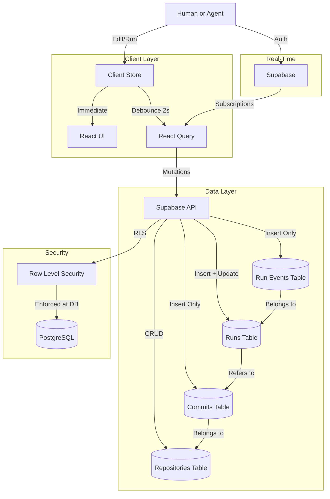

# Architecture: Distributed Process Control

> **Conceptual Model:** "Git for Process."
> This application is NOT a standard CRUD app. It is a Version Control System (VCS) optimized for checklists.

---

## 1. Core Data Models

### 1.1 Repositories (`repositories`)

The container for a process history.

- **Identity:** `id` (UUID), `slug` (human-readable URL identifier).
- **Ownership:** `owner_id` (UUID, FK to `auth.users`).
- **Lineage:**
  - `upstream_repo_id`: The parent repo if this is a fork.
  - `origin_repo_id`: The root ancestor (for graphing the full network).
- **Visibility:** `is_public` (Boolean).
- **Metadata:** `name`, `description`, `created_at`, `updated_at`.

### 1.2 Commits (`commits`)

**Immutable Snapshots** of the checklist content.

- **Rule:** NEVER update a commit's content. Create a NEW commit linked to the parent. This is the foundational invariant of the entire system.
- **Structure:**
  - `id`: UUID.
  - `repo_id`: FK to `repositories`.
  - `parent_commit_id`: The previous version (for traversing history). `NULL` for the initial commit.
  - `content`: `JSONB` blob (the entire checklist state — see Section 2).
  - `message`: Optional commit message describing the change.
  - `author_id`: FK to `auth.users` (who made this version).
  - `created_at`: Timestamp (immutable, set on insert).

**Traversal:** To reconstruct history, walk the `parent_commit_id` chain from HEAD to `NULL`.

### 1.3 Runs (`runs`)

An execution instance of a specific Commit.

- **Rule:** A run is tied to a specific `commit_id`. If the repo updates, old runs stay on the old commit. Runs never "migrate" to new versions.
- **State:**
  - `id`: UUID.
  - `commit_id`: FK to `commits` (pinned at creation).
  - `started_by`: FK to `auth.users`.
  - `status`: `pending` | `in_progress` | `completed` | `failed` | `cancelled`.
  - `progress`: `JSONB` tracking per-item completion status (separate from content).
  - `started_at`, `completed_at`: Timestamps.

### 1.4 Run Events (`run_events`)

Append-only audit log for each run.

- **Rule:** Events are never updated or deleted. They form the immutable audit trail.
- **Structure:**
  - `id`: UUID.
  - `run_id`: FK to `runs`.
  - `item_id`: UUID of the checklist item this event relates to.
  - `actor_type`: `human` | `agent`.
  - `actor_id`: UUID of the user or agent.
  - `action`: `completed` | `skipped` | `failed` | `note_added`.
  - `payload`: `JSONB` (structured output data from the step).
  - `created_at`: Timestamp.

---

## 2. The JSON Content Schema (Agent-Ready)

We use a **normalized map** to store items. This prevents array-index fragility during diffs and enables O(1) lookups.

```typescript
type ChecklistContent = {
  version: "1.0";
  metadata?: {
    estimated_duration_minutes?: number;
    tags?: string[];
    required_roles?: string[];
  };
  items: Record<string, ChecklistItem>; // Keyed by UUID
};

type ChecklistItem = {
  id: string;              // UUID
  text: string;            // "Check engine oil"
  description?: string;    // Optional rich description / instructions
  parent: string | null;   // UUID of parent item (null if root)
  order: number;           // Sorting index (0, 100, 200... — gap for insertions)
  collapsed?: boolean;

  // Execution constraints
  required?: boolean;          // Must be completed (cannot be skipped)
  assignee_type?: "human" | "agent" | "any";  // Who can execute this step

  // Agent configuration
  agent_config?: {
    action_type: "manual" | "browse" | "api" | "script";
    parameters?: Record<string, any>;       // JSON Schema inputs
    expected_output?: Record<string, any>;  // JSON Schema outputs
    timeout_seconds?: number;               // Max execution time
    retry_policy?: {
      max_attempts: number;
      backoff_ms: number;
    };
  };
};
```

**Why Normalized?**
- **O(1) Lookups:** Finding an item by ID is instant.
- **Clean Diffs:** Moving an item only changes its `parent` or `order` field, not its position in an array.
- **Agent-Friendly:** An agent can process items independently without understanding array semantics.

**Ordering Convention:** Use gaps of 100 between `order` values (`0, 100, 200, 300...`). This allows insertions between items without reindexing the entire list.

---

## 3. Critical Algorithms

### 3.1 The Forking Mechanic

When a user forks Repository A (at Commit 101):

1. **Create Repository B**: New entry in `repositories` table.
   - Set `upstream_repo_id` = Repository A's ID.
   - Set `origin_repo_id` = Repository A's `origin_repo_id` (or A's ID if A is the origin).
2. **Clone State**:
   - Read `content` from Commit 101.
   - Insert NEW Commit (201) into `commits` table linked to Repository B.
   - Set `content` = deep copy of Commit 101's content.
   - `parent_commit_id` = `NULL` (it is the initial commit of *this* repo's history).
3. **Metadata**: Copy repository metadata (name, description) with a "[Fork]" prefix or similar indicator.

**Invariant:** The forked content is a completely independent copy. Changes to Repository A do not propagate to B (and vice versa) unless explicitly merged.

### 3.2 The Auto-Save Loop

The Editor uses a specialized "Debounced Commit" strategy:

1. User edits checklist (Local State / Zustand updates immediately — no latency).
2. `useDebounce` waits for 2 seconds of inactivity.
3. **Diff Check:** Compare current state against the HEAD commit's content.
4. **Action:** If content differs, create a new row in `commits` with the new JSON.
5. **Optimization:** If the content is identical to HEAD (after deep comparison), do nothing.
6. **Error Handling:** If the commit fails, retry once after 3 seconds. If it fails again, show an inline error banner (not a toast — the user needs to know their work isn't saved).

```
User Types → Zustand (instant) → Debounce (2s) → Diff Check → Commit (if changed)
```

### 3.3 Building the Item Tree

Converting the flat normalized map into a renderable tree:

```typescript
function buildTree(items: Record<string, ChecklistItem>): TreeNode[] {
  const roots: TreeNode[] = [];
  const childrenMap = new Map<string | null, ChecklistItem[]>();

  // Group items by parent
  for (const item of Object.values(items)) {
    const siblings = childrenMap.get(item.parent) ?? [];
    siblings.push(item);
    childrenMap.set(item.parent, siblings);
  }

  // Sort each group by order
  for (const siblings of childrenMap.values()) {
    siblings.sort((a, b) => a.order - b.order);
  }

  // Recursively build tree from roots (parent === null)
  function buildNode(item: ChecklistItem): TreeNode {
    return {
      ...item,
      children: (childrenMap.get(item.id) ?? []).map(buildNode),
    };
  }

  return (childrenMap.get(null) ?? []).map(buildNode);
}
```

### 3.4 Commit Diffing

Comparing two commits for version history display:

- **Added Items:** Present in new commit but not in old.
- **Removed Items:** Present in old commit but not in new.
- **Modified Items:** Same ID exists in both but `text`, `order`, `parent`, or `agent_config` differs.
- **Display:** Show diffs at the item level (not the raw JSON level) for human readability.

---

## 4. Security & Permissions (RLS)

**PostgreSQL Row Level Security** is the primary defense. The client is assumed to be untrusted.

### 4.1 Policy Matrix

| Table          | Operation       | Policy                                                      |
| :------------- | :-------------- | :---------------------------------------------------------- |
| `repositories` | `SELECT`        | Public repos: anyone. Private repos: `owner_id` only.       |
| `repositories` | `INSERT/UPDATE` | `owner_id = auth.uid()` only.                               |
| `repositories` | `DELETE`        | `owner_id = auth.uid()` only.                               |
| `commits`      | `SELECT`        | Inherits from parent repository's visibility.               |
| `commits`      | `INSERT`        | User must be `owner_id` of the parent repository.           |
| `runs`         | `SELECT`        | `started_by = auth.uid()` OR repository owner.              |
| `runs`         | `INSERT`        | Authenticated users on public repos; owner on private repos. |
| `run_events`   | `SELECT`        | Inherits from parent run's visibility.                      |
| `run_events`   | `INSERT`        | Actor must be the run's `started_by` or an authorized agent. |

### 4.2 Security Invariants

- **No Client-Side Security:** All permission checks happen in RLS policies, never in React code. Client-side checks are purely cosmetic (hiding UI elements).
- **UUID Unpredictability:** UUIDs (v4) are used for all identifiers. They are not sequential and cannot be guessed.
- **Immutability Enforcement:** The `commits` table has no `UPDATE` or `DELETE` RLS policies. Commits are write-once.
- **Agent Authentication:** Agents authenticate via API keys scoped to specific repositories and permission levels.

---

## 5. Caching & Performance Strategy

### 5.1 React Query Configuration

```typescript
const queryClient = new QueryClient({
  defaultOptions: {
    queries: {
      staleTime: 1000 * 60 * 5,     // 5 minutes
      gcTime: 1000 * 60 * 30,       // 30 minutes garbage collection
      retry: 1,                      // Single retry on failure
      refetchOnWindowFocus: false,   // Prevent unnecessary refetches
    },
  },
});
```

### 5.2 Cache Invalidation Rules

| Event                   | Invalidation                                          |
| :---------------------- | :---------------------------------------------------- |
| New commit created      | Invalidate `['commits', repoId]` query                |
| Run status changed      | Invalidate `['runs', repoId]` query                   |
| Repository forked       | Invalidate `['repositories']` list query               |
| Repository settings changed | Invalidate `['repository', repoId]` query          |

### 5.3 Optimistic Updates

All mutations that affect the current user's view should use optimistic updates:

```typescript
useMutation({
  mutationFn: updateRunProgress,
  onMutate: async (newProgress) => {
    await queryClient.cancelQueries({ queryKey: ['run', runId] });
    const previous = queryClient.getQueryData(['run', runId]);
    queryClient.setQueryData(['run', runId], (old) => ({
      ...old,
      progress: { ...old.progress, ...newProgress },
    }));
    return { previous };
  },
  onError: (_err, _vars, context) => {
    queryClient.setQueryData(['run', runId], context.previous);
  },
  onSettled: () => {
    queryClient.invalidateQueries({ queryKey: ['run', runId] });
  },
});
```

---

## 6. Real-Time Subscriptions

### 6.1 When to Use Real-Time

- **Run execution:** When multiple users or agents are viewing/executing the same run.
- **Collaborative editing:** When two users may be editing the same repository simultaneously.

### 6.2 Supabase Realtime Pattern

```typescript
useEffect(() => {
  const channel = supabase
    .channel(`run:${runId}`)
    .on('postgres_changes', {
      event: 'UPDATE',
      schema: 'public',
      table: 'runs',
      filter: `id=eq.${runId}`,
    }, (payload) => {
      queryClient.setQueryData(['run', runId], payload.new);
    })
    .subscribe();

  return () => { supabase.removeChannel(channel); };
}, [runId]);
```

### 6.3 Conflict Resolution

- **Last-Write-Wins** for run progress updates (each item is independently completable).
- **Commit-Based** for content edits: if two users edit simultaneously, both create commits. The UI shows a "newer version available" banner, and the user can review and reconcile.

---

## 7. Error Handling Strategy

### 7.1 Error Categories

| Category        | Examples                               | Handling                                       |
| :-------------- | :------------------------------------- | :--------------------------------------------- |
| **Network**     | Timeout, offline, 5xx                  | Retry once, then show inline error with retry button |
| **Auth**        | 401, expired session                   | Redirect to login, preserve intended destination |
| **Validation**  | 400, schema mismatch                  | Show field-level errors inline                  |
| **Not Found**   | 404, deleted resource                  | Show empty state with navigation back           |
| **Permission**  | 403, RLS violation                     | Show "Access Denied" with explanation           |
| **Rate Limit**  | 429                                    | Show "Please wait" with countdown               |

### 7.2 Error Boundaries

- Wrap each major page section in a React Error Boundary.
- The fallback UI should show what went wrong and offer a "Try Again" button.
- Never let an error in one section crash the entire page.

### 7.3 Logging

- Client-side errors are logged with context (component, action, user ID).
- Network errors include the request URL, method, and status code.
- Never log sensitive data (tokens, passwords, PII).

---

## 8. API Design Conventions

### 8.1 Supabase Query Patterns

```typescript
// Service layer — pure functions, no React dependencies
// File: src/services/repositories.ts

export async function getRepository(id: string) {
  const { data, error } = await supabase
    .from('repositories')
    .select('*, commits(id, created_at, message)')
    .eq('id', id)
    .single();

  if (error) throw new DatabaseError(error.message, error.code);
  return data;
}

// Hook layer — React Query integration
// File: src/hooks/useRepository.ts

export function useRepository(id: string) {
  return useQuery({
    queryKey: ['repository', id],
    queryFn: () => getRepository(id),
    enabled: !!id,
  });
}
```

### 8.2 Naming Conventions

| Layer       | Pattern                      | Example                          |
| :---------- | :--------------------------- | :------------------------------- |
| **Service** | `verb + Noun`                | `getRepository`, `createCommit`  |
| **Hook**    | `use + Noun`                 | `useRepository`, `useCommits`    |
| **Mutation**| `use + Verb + Noun`          | `useCreateCommit`, `useForkRepo` |
| **Query Key** | `[noun, ...identifiers]`  | `['repository', id]`             |

### 8.3 Pagination

- Use cursor-based pagination (keyset) for large lists, not offset-based.
- Default page size: 20 items.
- Always return a `hasMore` indicator.

---

## 9. Testing Strategy

### 9.1 Testing Pyramid

| Level            | Tool          | Scope                                     | Coverage Target |
| :--------------- | :------------ | :---------------------------------------- | :-------------- |
| **Unit**         | Vitest        | Pure functions, utilities, store logic     | High            |
| **Component**    | Testing Library | Individual component rendering & interaction | Medium      |
| **Integration**  | Testing Library | Multi-component flows, React Query mocking | Medium       |
| **E2E**          | Playwright    | Critical user journeys                     | Key paths       |

### 9.2 What to Test

- **Always test:** Business logic (tree building, diffing, ordering), service functions, store actions.
- **Selectively test:** Component rendering with various states (loading, error, empty, populated).
- **E2E test:** Create checklist → Edit → Commit → Run → Complete flow.

### 9.3 What NOT to Test

- Radix/shadcn primitive behavior (tested upstream).
- Styling classes (visual regression testing is separate).
- Implementation details (test behavior, not internal state).

---

## 10. System Diagram


