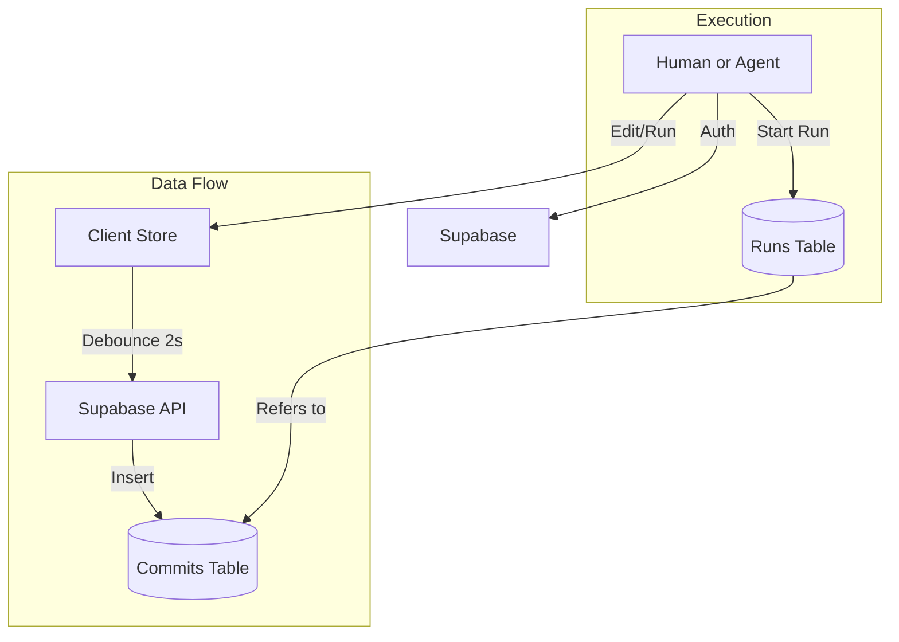

# Architecture: Distributed Process Control

> **Conceptual Model:** "Git for Process".
> This application is NOT a standard CRUD app. It is a Version Control System (VCS) optimized for checklists.

## 1. Core Data Models

### 1.1 Repositories (`repositories`)
The container for a process history.
- **Identity:** `id` (UUID).
- **Lineage:**
  - `upstream_repo_id`: The parent repo if this is a fork.
  - `origin_repo_id`: The root ancestor (for graphing the full network).
- **Visibility:** `is_public` (Boolean).

### 1.2 Commits (`commits`)
**Immutable Snapshots** of the checklist content.
- **Rule:** NEVER update a commit's content. Create a NEW commit linked to the parent.
- **Structure:**
  - `repo_id`: Link to container.
  - `parent_commit_id`: The previous version (for traversing history).
  - `content`: `JSONB` blob (The entire checklist state).

### 1.3 Runs (`runs`)
An execution instance of a specific Commit.
- **Rule:** A run is tied to a specific `commit_id`. If the repo updates, old runs stay on the old commit.
- **State:** `progress` (JSONB) tracks completion status separately from content.

## 2. The JSON Content Schema (Agent-Ready)

We use a **normalized map** to store items. This prevents array-index fragility during diffs.

```typescript
type ChecklistContent = {
  version: "1.0";
  items: Record<string, ChecklistItem>; // Keyed by UUID
};

type ChecklistItem = {
  id: string;        // UUID
  text: string;      // "Check engine oil"
  parent: string | null; // UUID of parent item (null if root)
  order: number;     // Sorting index (0, 100, 200...)
  collapsed?: boolean;
  
  // Future-proofing for AI Agents
  agent_config?: {
      action_type: "manual" | "browse" | "api";
      parameters?: Record<string, any>; // JSON Schema inputs
      expected_output?: Record<string, any>; // JSON Schema outputs
  };
};
```

**Why Normalized?**
- **O(1) Lookups:** finding an item by ID is instant.
- **Clean Diffs:** Moving an item only changes its `parent` or `order` field, not its position in an array.

## 3. Critical Algorithms

### 3.1 The Forking Mechanic
When a user forks Repository A (Commit 101):
1.  **Create Repository B**: New entry in `repositories` table.
    - Set `upstream_repo_id` = Repository A.
2.  **Clone State**:
    - Read `content` from Commit 101.
    - Insert NEW Commit (201) into `commits` table linked to Repository B.
    - Set `content` = Commit 101's content (Deep Copy).
    - `parent_commit_id` = NULL (It is the initial commit of *this* repo).

### 3.2 The Auto-Save Loop
The Editor uses a specialized "Debounced Commit" strategy:
1.  User edits checkist (Local State / Zustand updates immediately).
2.  `useDebounce` waits for 2 seconds of inactivity.
3.  **Action:** create a new row in `commits` with the new JSON.
4.  **Optimization:** If the content is identical to the HEAD commit (after diff), do nothing.

## 4. Security & Permissions (RLS)

**PostgreSQL Row Level Security** is the primary defense.

- **Public Repos:** `SELECT` allowed for `authenticated` and `anon`.
- **Private Repos:** `SELECT` allowed only for `owner_id`.
- **Mutations:** `INSERT/UPDATE` allowed ONLY for `owner_id`.
- **Runs:** Viewable only by the runner/owner.

## 5. System Diagram


